# 90minut  Football News Portal


> Single-page football news platform built with PHP, FlightPHP, MySQL and vanilla JS. Implements JWT authentication, role-based access control, and security measures including bcrypt + pepper password hashing, PDO prepared statements against SQL injection, and XSS sanitization. REST API documented with OpenAPI 3.0 / Swagger UI.

## Table of Contents

|  |  |  |
|---|---|---|
| [Preview](#preview) | [Overview](#overview) | [Project Status](#project-status) |
| [Tech Stack](#tech-stack) | [Security](#security) | [Features](#features) |
| [Application Flow](#application-flow) | [Architecture](#architecture) | [Setup](#setup) |
| [Walkthrough](#walkthrough) | [What I Learned](#what-i-learned) | [License](#license) |


## Preview

| Homepage | News Page |
|---|---|
| 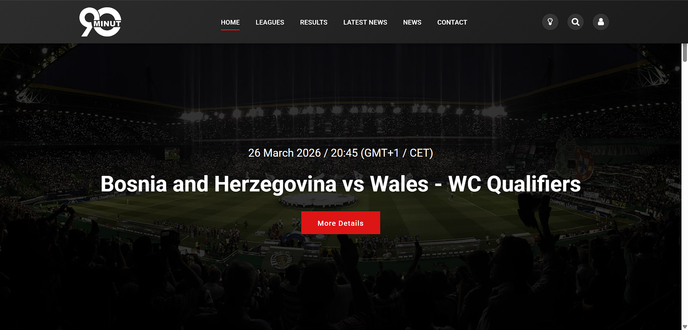 | 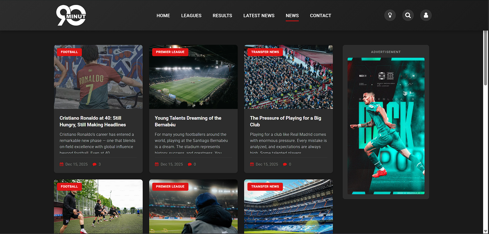 |

| Login | Admin Dashboard |
|---|---|
| 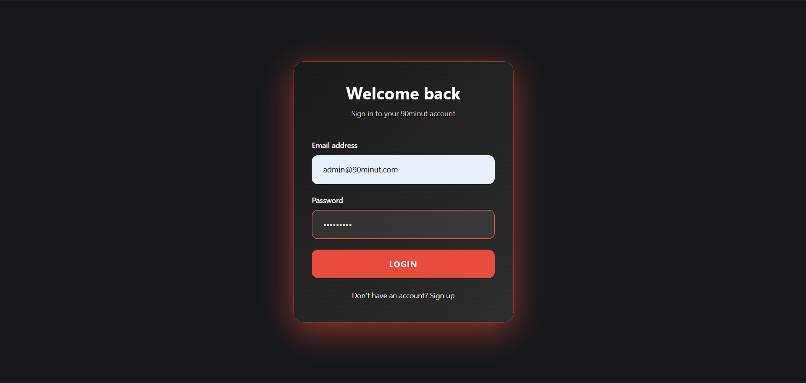 | 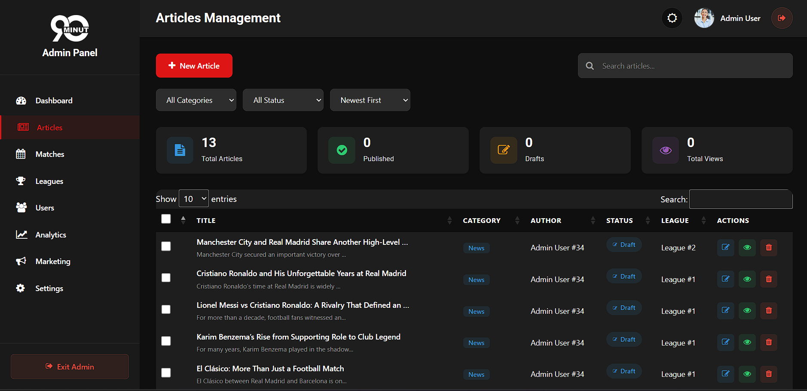 |

## Overview
**90minut** is a responsive, single-page football news portal. Think Klix.ba, but dedicated entirely to football. Visitors can browse articles by category, registered users can comment and manage their profile, and admins and moderators manage content through a dashboard.

The application is built on FlightPHP as the REST backend, communicates entirely via AJAX, and follows a strict three-layer architecture. DAO, Service, and Presentation layers are kept completely separate, and the frontend interacts with the backend strictly through the REST API.

The frontend uses a Bootstrap-based layout customized where needed. The primary focus of the project is backend architecture and security. If you're here for the PHP, the API, or the security implementation, that's where the interesting stuff is.

## Project Status

This project is currently in active development.

Core functionality is implemented and working end-to-end, including user registration and authentication, article creation and viewing, commenting, profile editing, and administrative CRUD operations for users and articles.

Some pages and UI sections are already scaffolded but not yet fully wired to backend logic. They exist to establish layout, routing structure, and future feature placement, and will be completed in upcoming iterations.

The current state reflects a functional and stable MVP with additional features and refinements in progress.

## Tech Stack
| Layer | Technology |
|---|---|
| Frontend | HTML5, CSS3, JavaScript ES6+, Bootstrap |
| Backend | PHP 8.3, FlightPHP 3.17 |
| Database | MySQL 9.1 |
| DB Access | PHP PDO (prepared statements) |
| Auth | JWT (JSON Web Tokens) |
| API Docs | OpenAPI 3.0 / Swagger UI |
| Local Dev | WAMP |
| Testing | Postman |


## Security

-   **Password Hashing:** Passwords are hashed using PHP’s `password_hash()` with `PASSWORD_DEFAULT`, which currently uses bcrypt and automatically applies a unique salt per password.  
  The per-password salt prevents identical passwords from producing identical hashes and protects against  rainbow tables.  
  Using `PASSWORD_DEFAULT` also allows seamless upgrades to stronger algorithms in future PHP versions without changing the code.
  _→ `backend/rest/services/UserService.php` → `createUser()`_
    
-   **Pepper:** Server-side secret appended before hashing. A full database dump is useless without it.  
    _→ `backend/config.php` → `Config::PEPPER()`, applied in `AuthService.php` → `register()` and `login()`_
    
-   **JWT Authentication:** Stateless, token-based auth with 24h expiry. Every protected endpoint validates the token server-side on each request.  
    _→ `backend/rest/services/AuthService.php`, `backend/middleware/AuthMiddleware.php`_
    
-   **Role-Based Access Control:** Three roles (`user`, `editor`, `admin`) enforced at the route level. Unauthorized requests return 403.  
    _→ `backend/rest/routes/` - e.g. `Flight::auth_middleware()->authorizeRole(Roles::ADMIN)`_
    
-   **SQL Injection Prevention:** Every database query uses PDO prepared statements with parameterized inputs. No user input concatenated into SQL strings.  
    _→ All DAO classes in `backend/rest/dao/`_
    
-   **XSS Protection:** All user-generated content is sanitized before being inserted into the DOM using a centralized Utils.escapeHtml() utility function.
This includes comments, usernames, article titles, and excerpts.  
    _→ `frontend/utils/utils.js`, applied in `article-detail-service.js`, `home-services.js`, `latest-news-service.js`, `news-service.js`_
    
- **Defense-in-Depth Validation:** Inputs are validated on both client and server layers, ensuring UX feedback while preventing trust in client-side enforcement.
    

## Features

The system is built around role-scoped capabilities enforced both in the API and in the UI layer.

- **Public access:** Article browsing, filtering by category/league, and full article view with comments.
- **Authenticated users:** Commenting system, profile management, and ownership-based actions enforced server-side.
- **Content roles (editor/admin):** Article creation and updates via protected endpoints with JWT + role validation middleware.
- **Administrative control:** User management, role assignment, and entity-level CRUD operations exposed only through authorized routes.

Permissions are enforced server-side through middleware and service-layer checks, ensuring that direct API calls without authorization result in a 403 response.

## Application Flow

```
User registers
  → password + pepper → bcrypt hash → stored in DB
  → plaintext never persisted

User logs in
  → password + pepper → password_verify() against stored hash
  → JWT issued (24h expiry) → stored in localStorage

Authenticated request
  → JWT sent in Authorization: Bearer <token> header
  → AuthMiddleware validates signature + expiry
  → role checked against required permission
  → 403 if unauthorized, data returned if authorized

User posts comment
  → user_id extracted from token server-side (never trusted from client)
  → content sanitized via escapeHtml() before DOM render

```


## Architecture

```
90MINUT/
├── backend/
│   ├── data/
│   │   └── roles.php
│   ├── middleware/
│   │   └── AuthMiddleware.php
│   ├── public/v1/docs/        # Swagger UI
│   ├── rest/
│   │   ├── dao/               # PDO queries
│   │   ├── routes/            # FlightPHP routes
│   │   └── services/          # Business logic
│   ├── config.php             # gitignored: DB credentials, JWT secret, pepper
│   └── index.php
├── frontend/
│   ├── assets/
│   ├── services/              # One JS service file per feature
│   ├── utils/
│   │   ├── constants.js
│   │   ├── rest-client.js
│   │   └── utils.js           # escapeHtml and shared utilities
│   ├── views/                 # One HTML file per view
│   ├── index.html
│   ├── login.html
│   └── register.html
├── .gitignore
├── 90minut_dump.sql
└── README.md

```


## Setup

### Prerequisites

-   [WAMP Server](https://www.wampserver.com/en/)

### Steps

**1. Clone**

```bash
git clone https://github.com/hasanovicnejla/90minut.git
```

**2. Move to WAMP web root**

```
C:/wamp64/www/90minut/
```

**3. Start WAMP** and  wait for tray icon to turn green.

**4. Import database**  
Open `http://localhost/phpmyadmin` → Import tab → select `90minut_dump.sql` → Go.  
Dump includes `CREATE DATABASE` so no manual setup needed.

**5. Configure `backend/config.php`**

```php
define('DB_HOST', 'localhost');
define('DB_NAME', '90minut');
define('DB_USER', 'root');
define('DB_PASS', '');
```

**6. Open in your browser**

```
http://localhost/90minut/frontend
```

### Test Accounts

| Role | Email | Password |
|---|---|---|
| Admin | admin@90minut.com | Admin123* |
| User | githubuser@90minut.com | User123* |
> Local development only.

## Walkthrough

### Homepage
The homepage highlights featured football news and upcoming matches.
In this example, the featured article showcases the upcoming match between Bosnia and Herzegovina national football team and Wales national football team on March 26th, demonstrating how important stories are surfaced to users immediately.
> 

### Register / Login
The login page handles user authentication and form validation on both client and server side.
After successful login, a JWT token is issued and stored for authenticated API requests.
>  

The registration page allows new users to create an account with validated input fields and password rules enforced on both client and server side.
After successful registration, users can log in and access authenticated features like commenting and profile management.
>  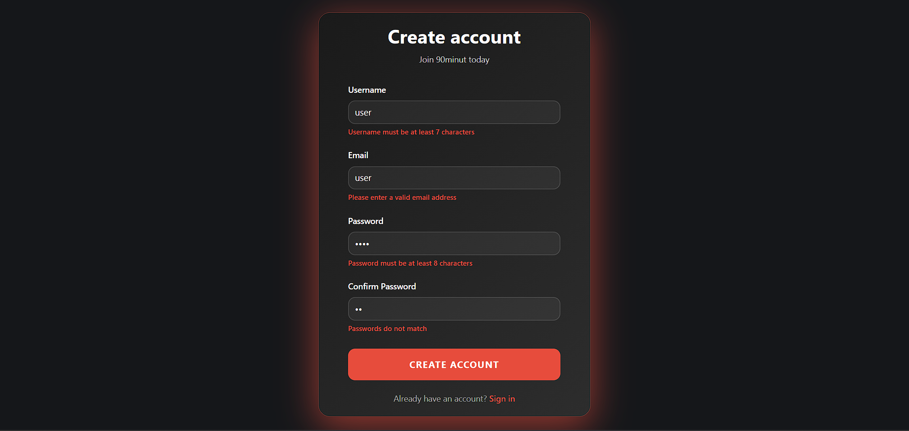

### Password Hash in Database
User passwords are never stored in plaintext.
>  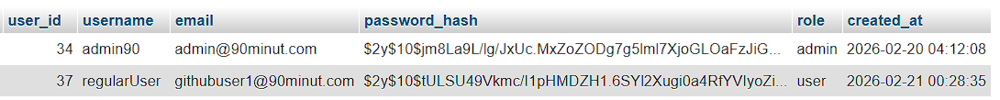

### JWT in Action
After a successful login request, the API returns a signed JWT token which is used for authenticated requests.
>  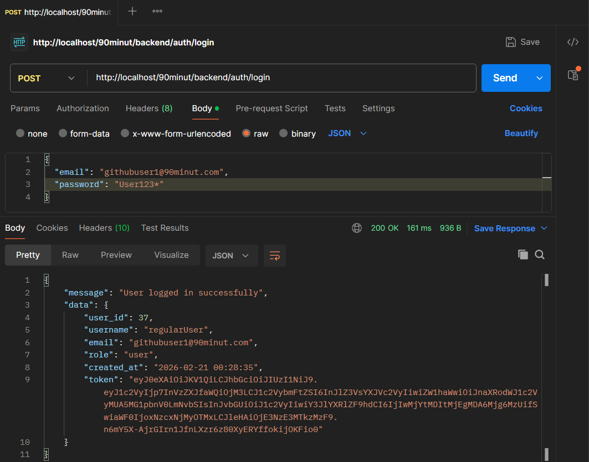

### Authorization test regular user – 403 Forbidden
When a regular user attempts to access admin-only endpoints, the API correctly responds with 403 Forbidden.
This confirms that role-based access control is enforced server-side and cannot be bypassed through direct API calls.
>  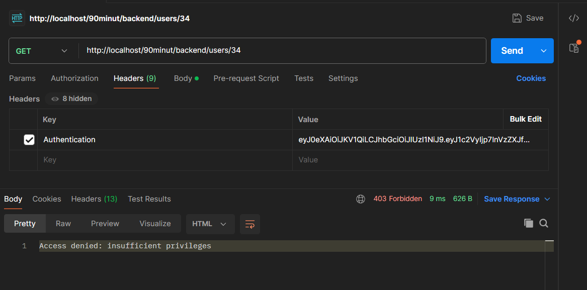

In the browser it looks like this
>  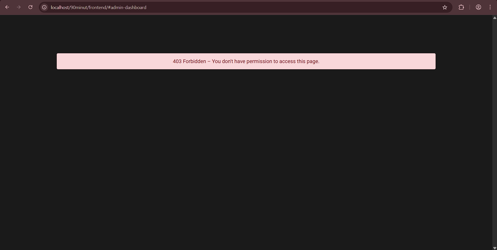

### Authorization test Admin 
In contrast, when the same request is made with an admin JWT token, the API returns the requested data successfully.
This demonstrates that access is controlled strictly by role claims inside the token, not by frontend visibility.
>  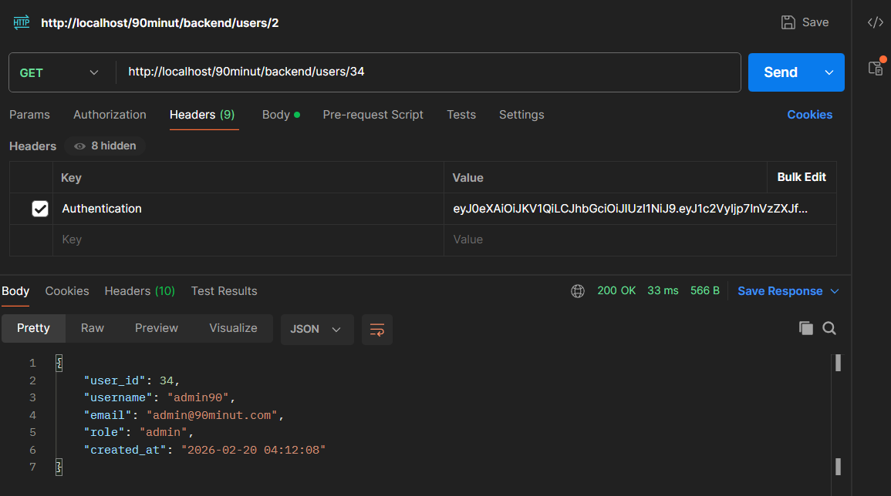

### Admin Articles Dashboard
The admin dashboard allows privileged users to create, edit, and delete articles through protected API endpoints.
All actions require a valid JWT token and proper role authorization, ensuring only editors/admins can modify content.
>  

### News page
This page lists articles fetched from the backend API and rendered dynamically via AJAX.
Users can open individual articles to read the full content and interact with comments.
>  

### Comment Section
Logged-in users can post comments which are tied to their account and validated server-side.
All user input is sanitized before rendering to prevent XSS attacks.
>  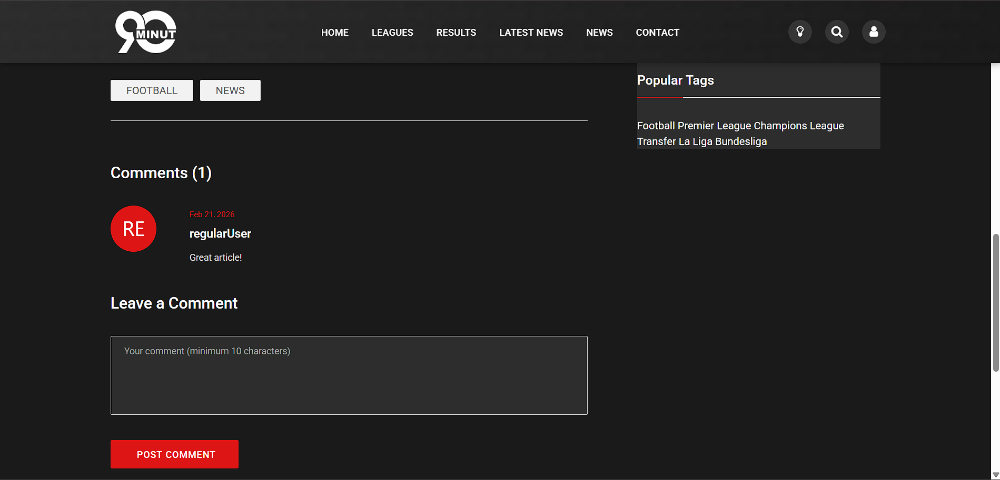

### Swagger UI
The Swagger UI provides an interactive overview of all available API endpoints, request formats, and responses.
It allows testing authenticated routes directly in the browser by supplying a JWT token, making it useful for both development and debugging.
>  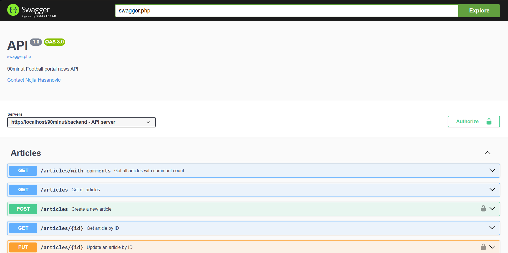


## What I Learned


The most valuable part of this project wasn't any single feature. It was the discipline of keeping layers separated and thinking about security at each one.

On the technical side: building a REST API from scratch in FlightPHP meant understanding routing, middleware, and request lifecycle without a framework doing the heavy lifting. Implementing JWT properly and not just generating a token but validating it on every request, scoping it to roles, and handling expiration time made authentication feel concrete rather than abstract. Writing every database query as a prepared statement becomes second nature quickly, but understanding _why_ (and what a SQLi payload actually looks like against a vulnerable query) makes it stick.

The security angle was the part I found most interesting. Applying OWASP Top 10 awareness to something I'd actually built  and being able to point to specific lines of code that address A01 (broken access control), A03 (injection, XSS), and A07 (authentication failures) is a different thing from knowing the list. Knowing OWASP categories is one thing. Having code in front of you where you can point to the exact line that prevents A03 is another.


## License

This project is open source and available under the MIT License.  
Feel free to use it for learning, academic work, or as a foundation for your own projects.

----------

_Built by Nejla Hasanović · Web Programming II · 2025_
